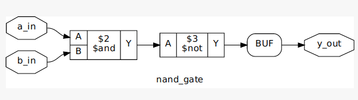
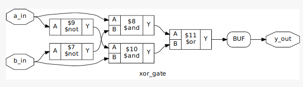

# Fundamental gates

### AND gate


Equation:

```verilog
Y = A & B
```

Truth Table:

| A | B | Output |
| --- | --- | --- |
| 0 | 0 | 0 |
| 0 | 1 | 0 |
| 1 | 0 | 0 |
| 1 | 1 | 1 |

### NAND gate



Equation:

```verilog
Y = ~(A & B)
```

Truth Table:

| A | B | Output |
| --- | --- | --- |
| 0 | 0 | 1 |
| 0 | 1 | 1 |
| 1 | 0 | 1 |
| 1 | 1 | 0 |

### OR gate


Equation:

```verilog
Y = A | B
```

Truth Table:

| A | B | Output |
| --- | --- | --- |
| 0 | 0 | 0 |
| 0 | 1 | 1 |
| 1 | 0 | 1 |
| 1 | 1 | 1 |

### NOR gate


Equation:

```verilog
Y = ~(A | B)
```

Truth Table:

| A | B | Output |
| --- | --- | --- |
| 0 | 0 | 1 |
| 0 | 1 | 0 |
| 1 | 0 | 0 |
| 1 | 1 | 0 |

### XOR gate



Equation:

```verilog
Y = A XOR B
```

Truth Table:

| A | B | Output |
| --- | --- | --- |
| 0 | 0 | 0 |
| 0 | 1 | 1 |
| 1 | 0 | 1 |
| 1 | 1 | 0 |

### XNOR gate


Equation:

```verilog
Y = ~(A XOR B)
```

Truth Table:

| A | B | Output |
| --- | --- | --- |
| 0 | 0 | 1 |
| 0 | 1 | 0 |
| 1 | 0 | 0 |
| 1 | 1 | 1 |

### Inverter


Equation:

```verilog
Y = ~A
```

Truth Table:

| A | Output |
| --- | --- |
| 0 | 1 |
| 1 | 0 |

### Buffer


Equation:

```verilog
Y = A
```

Truth Table:

| A | Output |
| --- | --- |
| 0 | 0 |
| 1 | 1 |

## Output


