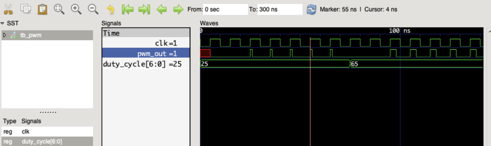

# PWM Generator



### Problem: PWM (Pulse Width Modulation) Generator

Design a PWM generator module in Verilog. The PWM generator should take a duty cycle percentage as input and generate a PWM signal with a configurable frequency.

### Steps to Run 

Compile the verilog module
```
% iverilog pwm.v
```

Now compile testbench module
```
% iverilog tb_pwm.v
% vvp a.out
```

Use the following to view the waveforms in GTKwave
```
% gtkwave tb_pwm.vcd
```

### Requirements:

The PWM generator should have the following input ports:

clk: Clock input
rst: Reset input (active high)
duty_cycle: Duty cycle percentage input (0 to 100, where 0 represents 0% and 100 represents 100% duty cycle).
frequency: Frequency input to set the PWM signal frequency.
The PWM generator should have the following output port:

pwm_out: PWM output signal.
The module should generate a PWM signal with a duty cycle as specified by the duty_cycle input.

The frequency of the PWM signal should be adjustable using the frequency input.

The duty cycle should be updated synchronously with the clock signal.

The PWM signal should have a 50% duty cycle when the duty_cycle input is 50%.

The module should be synthesizable and testable.

Bonus Points (Optional):

Implement multiple PWM channels with individual duty cycle and frequency settings.
Create a testbench to verify the functionality of your PWM generator.
PWM is commonly used for controlling the intensity of LEDs, the speed of motors, and other applications where analog-like control is needed with a digital signal.

As always, break down the problem into smaller tasks and design individual modules as needed. If you have any questions or need further assistance, feel free to ask. Happy coding and have fun with the PWM Generator design!
