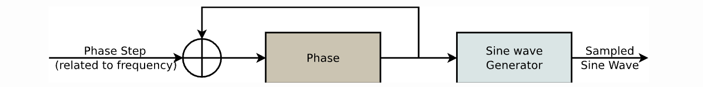
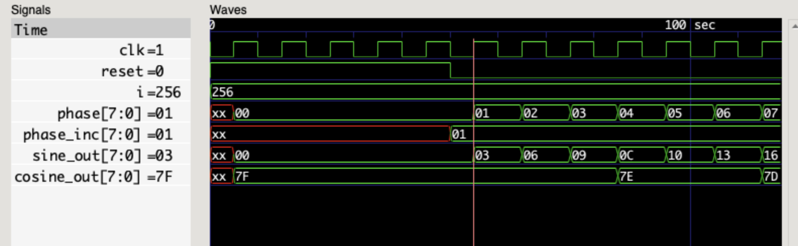

# 8-bit Numerically Controlled Oscillator



This RTL module implements a simple 8-bit Numerically Controlled Oscillator (NCO). The NCO can be used to generate sine and cosine waves at a programmable frequency.

## Pinout

| Name | Type | Length | Description |
|---|---|---|---|
| clk | input | 1 bit | Clock signal |
| reset | input | 1 bit | Asynchronous reset signal |
| phase_inc | input | 8 bits | Phase increment value. This value determines the frequency of the generated waveform. |
| sine_out | output | 8 bits | Sine wave output |
| cosine_out | output | 8 bits | Cosine wave output |

1. Compile using Icarus Verilog

```
iverilog -o nco_tb.out nco_tb.v nco.v 
vvp nco_tb.out
```

2. To view the waveform use GTKwave viewer. Once you have the tool installed you can trigger it using the following command

```
gtkwave nco_tb.vcd
```

The phase_inc value determines the frequency of the generated waveform. A higher phase_inc value will result in a higher frequency waveform. The following table shows the relationship between the phase_inc value and the frequency of the generated waveform:

| phase_inc | Frequency (Hz) |
|---|---|---|
| 1 | clk / 256 |
| 2 | clk / 128 |
| 4 | clk / 64 |
| 8 | clk / 32 |
| 16 | clk / 16 |
| 32 | clk / 8 |
| 64 | clk / 4 |
| 128 | clk / 2 |
| 256 | clk |

### Example

The following example shows how to use the NCO module to generate a 1 kHz sine wave:

```
assign phase_inc = 8'h01; // clk / 256
```

**Output Waveform**



---

## References

1. [Wikipedia: Numerically controlled oscillator](https://en.wikipedia.org/wiki/Numerically_controlled_oscillator)
2. [Building a Numerically Controlled Oscillator](https://zipcpu.com/dsp/2017/12/09/nco.html)
