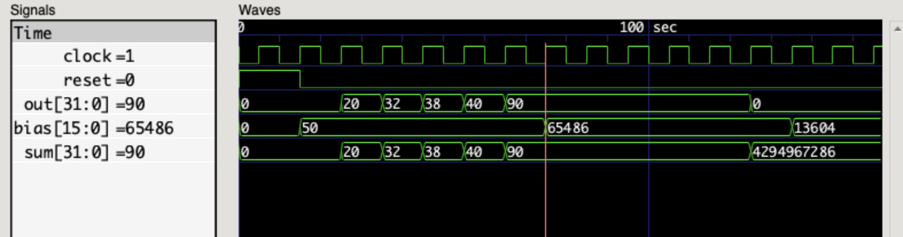

# 16-bit Neuron Unit RTL Module with ReLU Activation Function

This RTL module implements a simple 8-bit neuron unit. The neuron unit has four inputs, four weights, and one bias. It performs a weighted sum of the inputs and the bias, and then applies a rectified linear unit (ReLU) activation function to the output.

## Pinout

| Name | Type | Length | Description |
|---|---|---|---|
| clock | input | 1 bit | Clock signal |
| reset | input | 1 bit | Asynchronous reset signal |
| x0 | input | 16 bits | First input value |
| x1 | input | 16 bits | Second input value |
| x2 | input | 16 bits | Third input value |
| x3 | input | 16 bits | Fourth input value |
| w0 | input | 16 bits | First weight value |
| w1 | input | 16 bits | Second weight value |
| w2 | input | 16 bits | Third weight value |
| w3 | input | 16 bits | Fourth weight value |
| bias | input | 16 bits | Bias value |
| sum | output | 32 bits | Weighted sum of the inputs and the bias |
| out | output | 32 bits | Output of the ReLU activation function |

### Output waveform

The neuron unit module is a simple example of a neural network layer. More complex neural network layers can be implemented by cascading multiple neuron unit modules together.

The neuron unit module is not optimized for performance or power consumption. More efficient implementations can be developed using specialized hardware or software

## References:

1. [Rectifier (neural networks)](https://en.wikipedia.org/wiki/Rectifier_(neural_networks))
